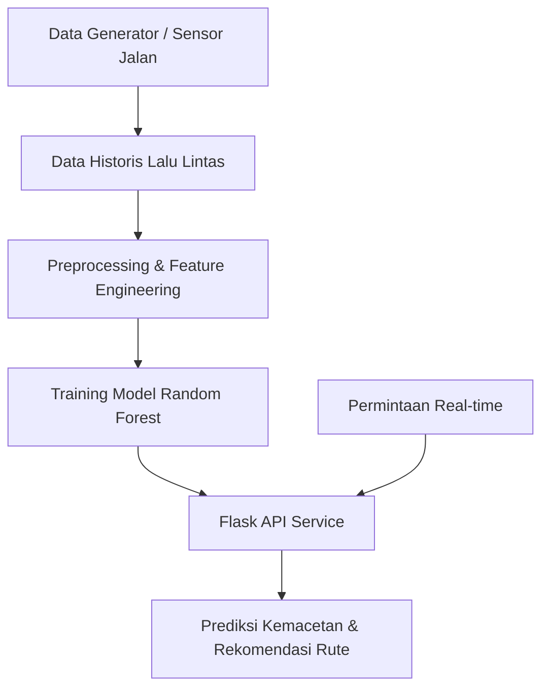

# 🧠 RANCANGAN SISTEM KECERDASAN BUATAN

## Prediksi Kemacetan Lalu Lintas Kota Bengkulu

### *(Smart City Use Case)*

Sistem ini merupakan inisiatif kecerdasan buatan untuk mendeteksi dan memprediksi kemacetan lalu lintas secara real-time di Kota Bengkulu. Dengan memanfaatkan data lalu lintas sintetis lokal dan algoritma pembelajaran mesin, sistem ini bertujuan untuk meningkatkan efisiensi mobilitas, menyediakan rekomendasi rute, serta mendukung pengambilan keputusan oleh Dinas Perhubungan dalam ekosistem Smart City.

---

## 🔍 Tujuan Proyek

- Memprediksi tingkat kemacetan berdasarkan volume kendaraan, kecepatan, waktu, dan cuaca.
- Memberikan informasi kondisi lalu lintas terkini dan prediksi ke depan.
- Menyediakan rute alternatif berdasarkan kondisi lalu lintas aktual.
- Memberikan insight berbasis data untuk perencanaan transportasi perkotaan.

---

## 1️⃣ Model AI yang Digunakan dan Alasan Pemilihannya

**Model:** `RandomForestClassifier` (Scikit-learn)

**Keunggulan Model:**

- **Non-linear modeling:** Mampu menangani interaksi kompleks antar fitur seperti jam, cuaca, kecepatan.
- **Robust:** Tahan terhadap overfitting berkat pendekatan ensemble.
- **Interpretable:** Menyediakan metrik penting seperti feature importance.
- **Efisien:** Waktu inferensi cepat untuk kebutuhan prediksi real-time.

---

## 2️⃣ Jenis dan Sumber Data

### 📁 Jenis Fitur:

- **Temporal:** `hour`, `day_of_week`, `is_weekend`, `is_rush_hour`, `is_market_day`, `hour_sin`, `hour_cos`, `day_sin`, `day_cos`
- **Lalu Lintas:** `traffic_volume`, `average_speed`, `has_incident`
- **Lingkungan:** `weather`
- **Spasial:** `road_segment`
- **Label Target:** `traffic_level` {`Lancar`, `Ramai Lancar`, `Padat`, `Macet`}

### 🌐 Sumber Data:

- **Saat ini:** Generator data sintetik berbasis lokal (`BengkuluTrafficDataGenerator`)
- **Rencana ke depan:**
  - Sensor volume kendaraan (IoT)
  - CCTV kota & API cuaca (BMKG)
  - Integrasi aplikasi navigasi (Waze, Google Maps)

### 🧼 Praproses Data:

- Encoding kategorikal: `weather`, `road_segment`
- Transformasi waktu siklik: `sin/cos` untuk jam & hari
- Feature engineering: penanda `rush hour`, `hari pasar`, `siang/malam`
- Split data: 80% train, 20% test
- Penambahan noise & simulasi insiden: 3% probabilitas acak

---

## 3️⃣ Desain Alur Kerja Sistem

### 🔄 Proses End-to-End:

1. Data lalu lintas dikumpulkan (sintetik / sensor nyata)
2. Fitur disiapkan & dikodekan
3. Model AI dilatih dan dievaluasi
4. API Flask menyajikan hasil prediksi & rute
5. Pengguna & admin mengakses melalui frontend / dashboard

### 🗺️ Diagram Alur:



---

## 4️⃣ Evaluasi Model & Kinerja

### 🎯 Strategi:

- Validasi menggunakan data testing (20%)
- Evaluasi berdasarkan kelas kemacetan

### 📊 Metrik:

- **Accuracy:** Akurasi keseluruhan model (±90%)
- **Precision, Recall, F1-score:** Per kelas
- **Feature Importance:** Top 5 fitur: `traffic_volume`, `average_speed`, `hour`, `weather`, `road_segment`

### 📌 Observasi:

- Performa optimal pada jam sibuk (pagi & sore) dan hari pasar (Jumat)
- Fitur cuaca & volume kendaraan paling dominan

---

## 5️⃣ Rencana Pengembangan Lanjutan

### 🔗 Integrasi Data Real-Time:

- Sensor dan CCTV lalu lintas kota
- API BMKG untuk cuaca dinamis
- Aplikasi mobile masyarakat untuk crowdsourcing data

### 🧠 Model AI Lanjutan:

- LSTM untuk prediksi jangka panjang (berbasis time-series)
- Reinforcement Learning untuk adaptasi lampu lalu lintas
- Hybrid AI + Rule-based system

### 📱 Antarmuka Pengguna:

- Dashboard interaktif
- Aplikasi Web & Mobile
- Notifikasi berbasis lokasi dan kondisi lalu lintas terkini

### 🛰️ Sistem Monitoring:

- Deteksi anomali lalu lintas otomatis
- Integrasi ke Command Center Kota

---

## 🚀 Teknologi yang Digunakan

- Python, Pandas, NumPy
- Scikit-learn (`RandomForestClassifier`)
- Flask API
- HTML/CSS/JS (untuk frontend demo)
- Visualisasi data (CLI dan JSON endpoint)

---

## 📂 Struktur Proyek

```
├── AI.py                  # Logika utama: data generator, model AI, evaluasi
├── app.py                 # Flask API endpoints untuk prediksi dan rute
├── templates/index.html   # UI utama (opsional)
├── static/                # File frontend tambahan (opsional)
└── README.md              # Dokumentasi proyek
```

---

## 📎 Lisensi dan Distribusi

Proyek ini dirilis untuk tujuan edukasi dan eksplorasi teknologi kota cerdas. Untuk distribusi atau kolaborasi, silakan hubungi tim pengembang melalui repositori ini.

---

## 👥 Tim Pengembang

- AI Engineer: [Nama Anda]
- Data Engineer: [Nama Anda]
- Full Stack Developer: [Nama Anda]
- Dinas Perhubungan Kota Bengkulu (mitra kolaboratif)

---

> "Dengan sistem ini, Kota Bengkulu melangkah menuju kota cerdas yang tidak hanya responsif terhadap kemacetan, tetapi juga proaktif dalam menciptakan mobilitas yang berkelanjutan dan berbasis data."
